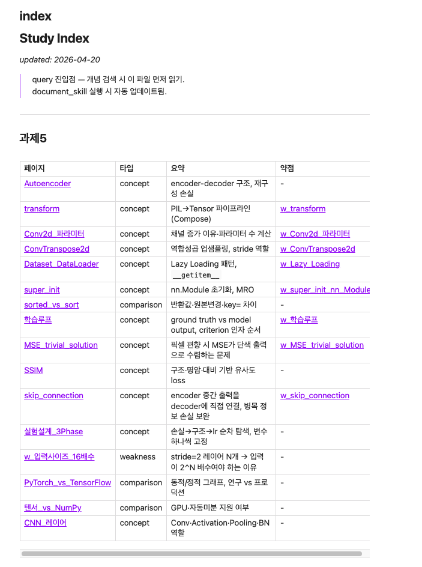
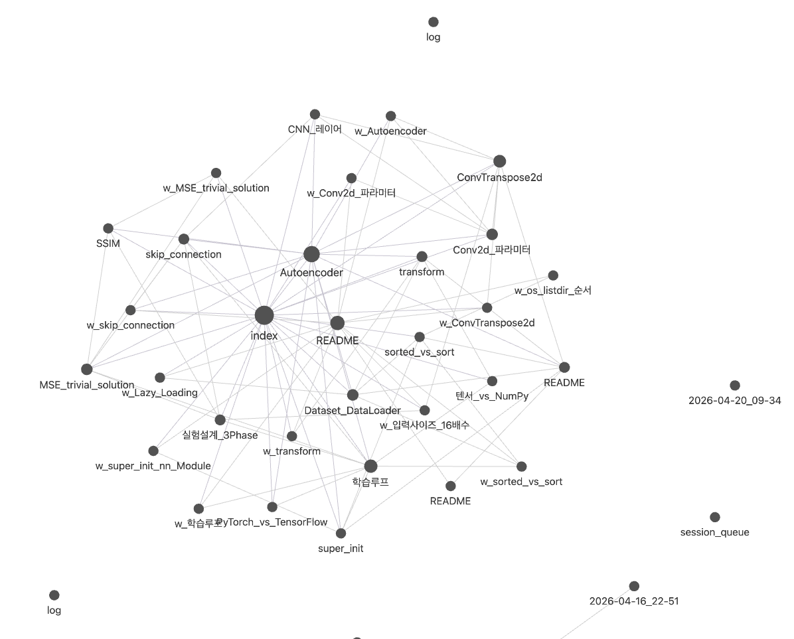
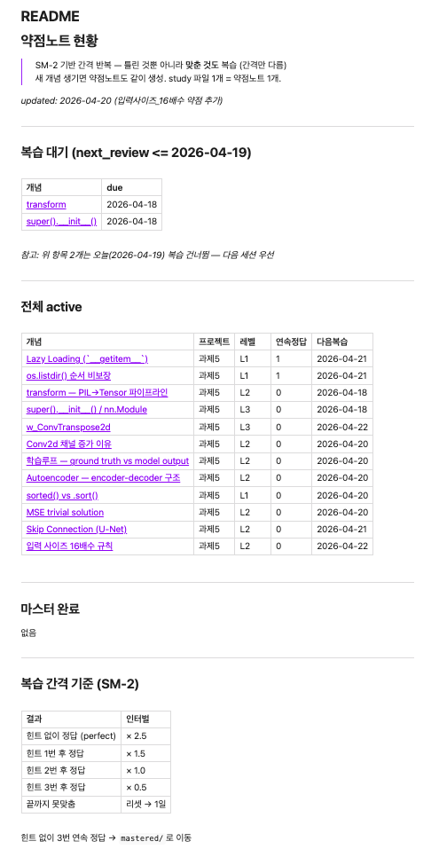
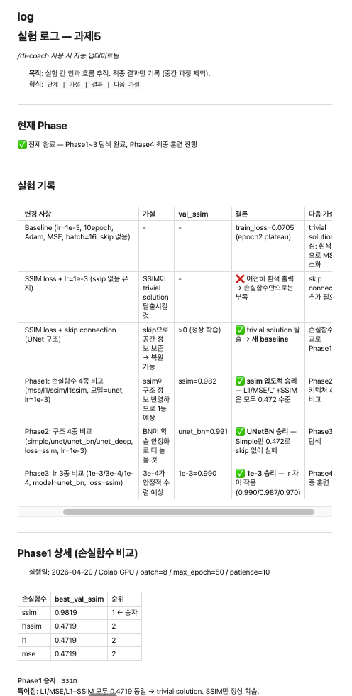
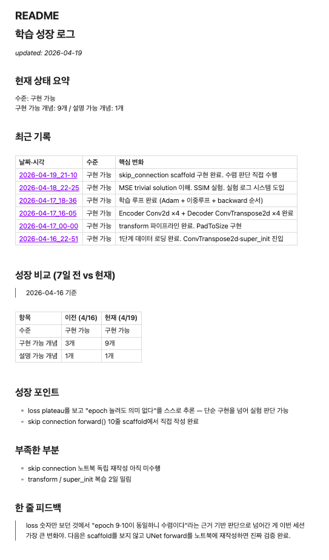

# Claude Code 학습 시스템

Claude Code CLI를 활용한 LLM-wiki 기반 딥러닝 학습 프레임워크.  
개념 이해 → 코드 구현 → 검증 → wiki 문서화까지 세션 단위로 관리한다.

---

## 미리보기

| Study Index | Obsidian Graph |
|:-----------:|:--------------:|
|  |  |

| 약점노트 (SM-2) | 실험 로그 |
|:--------------:|:---------:|
|  |  |

| 학습 성장 로그 | |
|:--------------:|:-:|
|  | |

> 스크린샷은 `docs/screenshots/` 에 저장하면 자동으로 표시됨.

---

## 구조

```
.claude/        ← 튜터 규칙·워크플로우 (rules, skills, docs)
scripts/        ← 자동화 도구 (bootstrap, SM-2, lint, validate)
projects/       ← 프로젝트별 Raw 데이터·코드 (Git 제외)
study/          ← LLM이 관리하는 Wiki (개념 노트, 약점노트, 실험 로그)
CLAUDE.md       ← Claude Code 세션 진입점 (규칙 총괄)
```

## 시작하는 법

**1. 레포 클론**
```bash
git clone https://github.com/beomjinkim2000/Study_code.git
cd Study_code
```

**2. 프로젝트 데이터 추가** (Git 미포함 — 직접 넣기)
```bash
mkdir -p projects/{project_name}/code
mkdir -p projects/{project_name}/data
```

**3. Wiki 구조 초기화**
```bash
python3 scripts/bootstrap.py {project_name}
```
→ `study/projects/{project_name}/` 하위에 README, scaffold, 실험 로그 자동 생성

**4. Claude Code로 세션 시작**
```bash
claude
```
→ CLAUDE.md 규칙에 따라 세션 시작 워크플로우 자동 실행

---

## 세션 흐름

```
개념 질문 → 설명 + 이해 확인
         → scaffold 작성 (Learn by Doing)
         → 검증 (노트북 독립 재작성 가능?)
         → document_skill: wiki 문서화 + SM-2 약점노트
```

## 세션 큐 (`study/session_queue.md`)

개념·코드 학습 상태를 3단계로 추적한다.

```
이해중 → 구현중 → 검증중 → (제거)
```

| 상태 | 조건 |
|------|------|
| 이해중 | 개념 설명을 듣는 중 |
| 구현중 | scaffold에 코드 작성 중 |
| 검증중 | 구현 완료, 노트북 독립 재작성 + 설명 가능한지 확인 중 |

검증 통과 → `document_skill` 실행 → 큐에서 제거  
큐가 비면 세션 종료 조건 체크.

## 주요 기능

### 약점노트 + SM-2 복습 (`study/약점노트/`)
개념을 문서화할 때 자동으로 약점노트(`w_*.md`)가 생성된다.  
SM-2 알고리즘으로 복습 간격을 계산해 `next_review` 날짜를 관리한다.  
세션 시작 시 Claude가 `next_review <= 오늘`인 항목을 먼저 복습하도록 유도한다.

```
힌트 없이 정답 → 간격 × 2.5  /  틀림 → 1일 리셋  /  3회 연속 정답 → mastered
```

### 실험 로그 (`study/projects/{name}/experiments/log.md`)
하이퍼파라미터 탐색 결과를 Phase별로 기록한다.  
bootstrap 실행 시 Phase 1~3 + 최종 선택 템플릿이 자동 생성된다.

### 학습 인사이트 (`study/학습인사이트.md`)
세션 종료 시 Claude가 자동으로 덮어쓴다.  
현재 이해 수준·잘 잡힌 개념·아직 흔들리는 개념을 스냅샷으로 저장한다.  
날짜별 이력은 `study/학습인사이트_log/`에 누적된다.

### Wiki Lint (`scripts/wiki_lint.py`)
세션 종료 시 자동 실행되며 다음 항목을 점검한다.

| 점검 항목 | 감지 조건 |
|-----------|----------|
| orphan link | `[[링크]]` 대상 파일 없음 |
| SM-2 만료 | `next_review <= 오늘` |
| index 누락 | study 파일이 index.md에 없음 |

---

## Obsidian 연동

`study/` 폴더를 Obsidian vault로 열면 wiki를 그래프·검색으로 탐색할 수 있다.

**심볼릭 링크로 연결하기 (권장)**
```bash
ln -s /path/to/Study_code/study ~/Documents/Obsidian/study-wiki
```

Obsidian에서 `~/Documents/Obsidian/study-wiki` 폴더를 vault로 열면 된다.

- `[[링크]]` → Obsidian wikilink로 바로 이동
- Graph view → 개념 간 연결 구조 시각화
- Dataview 플러그인 → frontmatter 기반 쿼리 (`type`, `project`, `tags`)
- `study/약점노트/active/` → SM-2 복습 현황 한눈에 확인

> 심볼릭 링크를 쓰면 Claude가 파일을 수정할 때 Obsidian에서 실시간으로 반영된다.

## 슬래시 커맨드

Claude Code 세션 안에서 `/명령어`로 호출한다.

| 커맨드 | 설명 |
|--------|------|
| `/setup-project {name}` | 새 프로젝트 wiki 구조 초기화 (bootstrap 래퍼) |
| `/check-progress {name}` | README 구현 체크리스트 업데이트 |
| `/dl-coach` | DL 실험 설계 코칭 세션 시작 |
| `/review-session` | 세션 후 wiki 상태 리뷰 (큐·인사이트·lint 점검) |
| `/harness` | 전체 워크플로우 검증 (wiki + 튜터 + 코치 한번에) |

커맨드 정의 파일은 `.claude/commands/` 에 있으며 자유롭게 수정·추가할 수 있다.

## 주요 스크립트

| 명령어 | 역할 |
|--------|------|
| `python3 scripts/bootstrap.py {name}` | 새 프로젝트 wiki 초기화 |
| `python3 scripts/wiki_lint.py` | wiki 구조 검증 (orphan link, SM-2 만료 등) |
| `python3 scripts/test_bootstrap.py` | 전체 단위 테스트 실행 |
